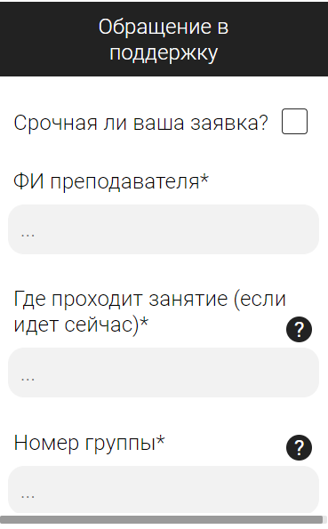
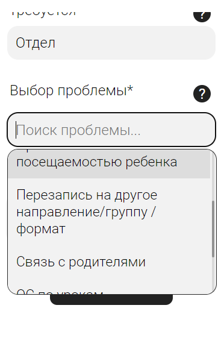
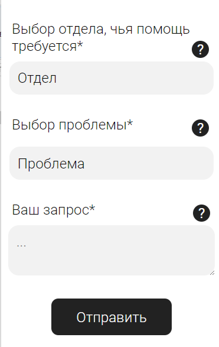
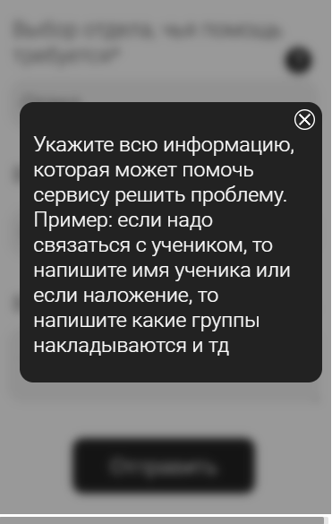
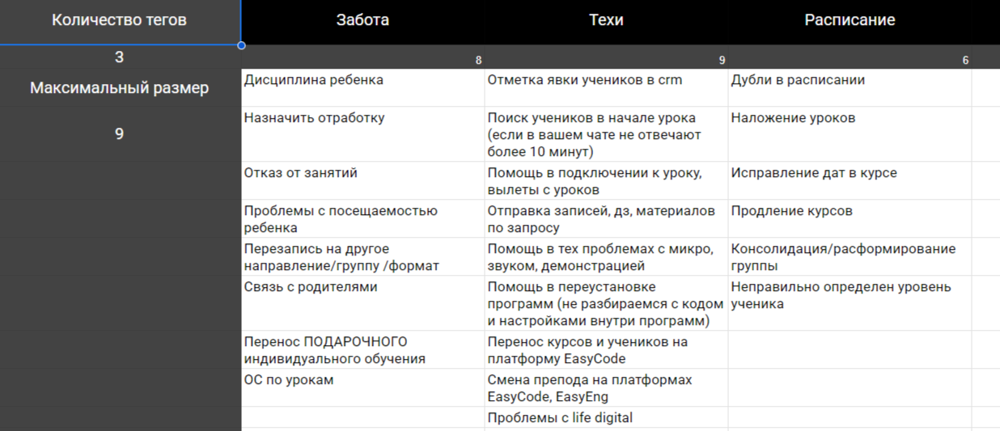

# Support Bot

Телеграм бот технической поддержки с веб-интерфейсом для обработки заявок. Интегрирован с UseDesk и Google Sheets.

## Описание

Бот предназначен для обработки заявок от преподавателей по техническим вопросам, проблемам с расписанием и поддержкой учеников. Заявки создаются через удобную веб-форму в Telegram и автоматически направляются в систему тикетов UseDesk.

### Основные возможности:

- Создание заявок через веб-форму в Telegram
- Создание заявки через чат с ботом
- Интеграция с UseDesk для управления тикетами
- Синхронизация данных с Google Sheets
- Уведомления о статусе заявок
- Категоризация заявок по отделам и типам проблем
- Возможность писать ответы на заявки через usedesk
- Данные для формы подтягиваются из Google Sheets

## Скриншоты

### Форма создания заявки

### Пример списка с поиском

### Дополнительная информация

### Подсказки для пользователей

### Данные для формы

